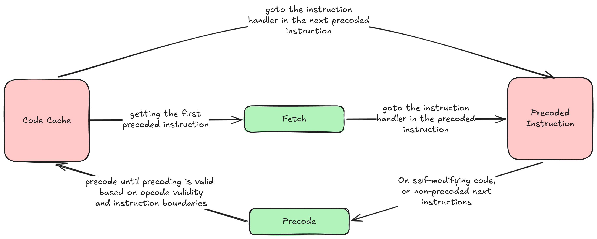
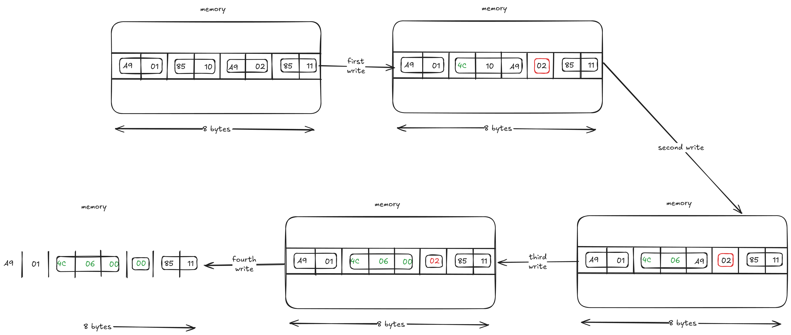

### Problem Context
The direct threading with static precoding is invalid when the binary has,
- **Self Modifying Code**, if there are instructions that modify other instructions, then static precoding will lead to invalidated instructions in the code cache leading to incorrect execution.
- **Code discovery challenges**, the static precoding stops when the instruction is invalid, i.e., it encounters data blocks, but there could be instructions beyond the data blocks which have not been precoded.

### Minimal Solution
- **For self modifying code**, add support for invalidating the corresponding precoding in the code cache and dynamically precode the updated instruction during execution to add to the code cache.
- **For data interspersed with code**, add support for dynamically precoding the instructions during execution.
- **To find the set of instructions to dynamically precode during execution**, store instruction starts and their mapping to code cache indexes, to know where to start dynamically precoding from and where to stop.

### Implementation

The modification of execution,



1. Adding additional state members in the chip state,
   ```c
    cpu_state:
        accumulator
        index_x, index_y
        status_register
        stack_pointer
        program_counter
        memory[65536]
        code_cache[CODE_CACHE_CAPACITY]  
        translation_map[MEMORY_SIZE]    
        cache_length
        instruction_start_map[CODE_CACHE_CAPACITY]
    ```
   The added member is the instruction start map, which stores the mapping of each address at which an instruction exists, to the address at which that instruction starts.
2. Adding support for code cache and instruction start mapping invalidation,
   ```c 
   function invalidate_translation(cpu_state, spc):
        if translation_map[spc] is not EMPTY:
            translation_map[spc] ← EMPTY

   function invalidate_instruction_ownership(cpu_state, spc):
       i ← spc
       while i < MEMORY_SIZE and instruction_start_map[i] == spc:
           instruction_start_map[i] ← EMPTY
           i ← i + 1
   ```
3. Allowing precoding on a more granular level,
    ```
   function translate_one(cpu_state, dispatch_table, spc, tpc) → length | FAIL:
       opcode ← memory[spc]
   
       if opcode is not valid or spc + instruction_length[opcode] > MEMORY_SIZE:
           invalidate_translation(cpu_state, spc)
           return FAIL
   
       invalidate_instruction_ownership(cpu_state, spc) 
   
       length ← instruction_length[opcode]
   
       threaded_instr ←
           handler        : dispatch_table[opcode].label_address
           mode           : dispatch_table[opcode].addressing_mode
           operand        : bytes at memory[spc+1 .. spc+length]
           spc_byte_offset: length
   
       for i in 0 .. length-1:
           instruction_start_map[spc + i] ← spc
   
       code_cache[tpc]      ← threaded_instr
       translation_map[spc] ← tpc
   
       return length
    ```
4. Adding support to dynamically precode,
    ```
   function translate(cpu_state, dispatch_table):
       spc ← cpu_state.program_counter
   
       while cache_length < CODE_CACHE_CAPACITY:
           length ← translate_one(cpu_state, dispatch_table, spc, cache_length)
           if length is FAIL:  break
   
           cache_length ← cache_length + 1
           spc          ← spc + length
    ```
5. Detecting self modifying code,
   ```
   function detect_self_modifying_code(cpu_state, dispatch_table, modified_address):
       // if the modified address is not recorded as an 
       // instruction start address, no instructions were modified
       owner_spc ← instruction_start_map[modified_address]
       if owner_spc is EMPTY:  return          
      
       // if an instruction exists at that address, check to see
       // if a translation exists for the corresponding start address
       // of the instruction in the translation map
       tpc ← translation_map[owner_spc]
      
       // if a translation exists, the translation is modified
       // if it doesn't, a new translation is added
       if tpc is EMPTY:
           tpc ← cache_length
       length ← translate_one(cpu_state, dispatch_table, owner_spc, tpc)
       if length is FAIL:  return
       
       // the code modification can change code boundaries, interfering
       // with other instructions, so translation should keep happening
       // until a valid state for the program counter (as kept for translation)
       // is seen
       next_spc ← owner_spc + length
       while not (instruction_start_map[next_spc] == next_spc
                  and translation_map[next_spc] is not EMPTY):
   
           tpc    ← translation_map[next_spc]   // reuse slot or append
           if tpc is EMPTY:
               if cache_length >= CODE_CACHE_CAPACITY:  return
               tpc ← cache_length
           length ← translate_one(cpu_state, dispatch_table, next_spc, tpc)
           if length is FAIL:  return
   
           next_spc ← next_spc + length
   ```
   This function precodes the instruction that exists in the address that has been modified, and if the modification interferes with the existing instruction boundaries, then multiple instructions have to be re-precoded until the precoding is valid.
   
   The way self modifying code could work,
   
   
   1. Original state:
      ```asm
      LDA $01
      STA $10
      LDA $02
      STA $11
      ```

   2. First write:
      ```asm
      LDA $01
      JMP $A910
      <INVALID>
      STA $11
      ```
      The function:
      - detects the address to which a write has occurred as an instruction address
      - detects the address already has a translation in the cache
      - calls the `translate_one` function to translate the updated instruction, adding a new translation to the cache

   3. Second write:
      ```asm
      LDA $01
      JMP $A906
      <INVALID>
      STA $11
      ```
      The function:
      - detects the address to which a write has occurred as an instruction address
      - detects the address already has a translation in the cache
      - calls the `translate_one` function to translate the updated instruction, updating the translation in the cache
      - notices that the code boundaries have changed and calls `translate_one` repeatedly until the instruction memory is valid

   4. Third write:
      ```asm
      LDA $01
      JMP $0806
      <INVALID>
      STA $11
      ```
      The function:
      - detects the address to which a write has occurred as an instruction address
      - detects the address already has a translation in the cache
      - calls the `translate_one` function to translate the updated instruction, updating the translation in the cache
      - notices that the code boundaries have changed and calls `translate_one` repeatedly until the instruction memory is valid

   5. Fourth write:
      ```asm
      LDA $01
      JMP $0806
      BRK
      STA $11
      ```
      The function:
      - detects the address to which a write has occurred as an instruction address
      - detects the address already has a translation in the cache
      - calls the `translate_one` function to translate the updated instruction, adding a new translation to the cache
      - notices that the code boundaries are no longer changing
6. If precoded mappings are not found, then dynamic precoding has to take place while proceeding to the next instruction normally or during jumps,
   ```
   macro NEXT(cpu_state, current_instr):
       cpu_state.program_counter ← cpu_state.program_counter + current_instr.spc_byte_offset
   
       if translation_map[cpu_state.program_counter] is EMPTY:
           old_length ← cache_length
           translate(cpu_state, dispatch_table)
           if cache_length == old_length:
               error "could not translate at current PC"
               halt
   
       current_instr ← code_cache[ translation_map[cpu_state.program_counter] ]
       goto current_instr.handler
   
   macro JUMP(cpu_state, current_instr, target_address):
       cpu_state.program_counter ← target_address
   
       if translation_map[cpu_state.program_counter] is EMPTY:
           old_length ← cache_length
           translate(cpu_state, dispatch_table)
           if cache_length == old_length:
               error "could not translate at target address"
               halt
   
       current_instr ← code_cache[ translation_map[cpu_state.program_counter] ]
       goto current_instr.handler                                                            \
   ```
   The function `translate` is called which dynamically precodes the next batch of instructions, which couldn't have been statically precoded due to issues with code discovery. 
   The dynamic translation is necessary as static translation could not have discovered all the sections of memory which contain code, and this is due to the code discovery problem. 