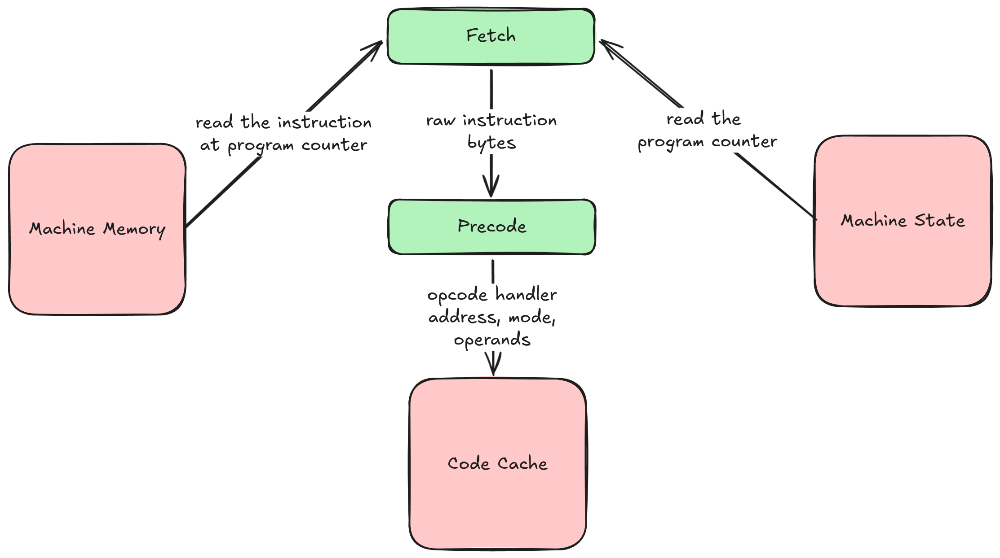
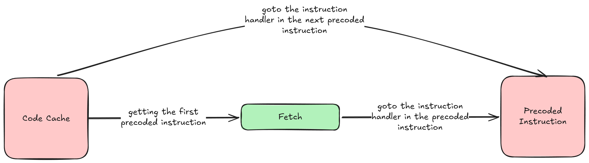

### Problem Context

The fetch-decode-execute implementation follows interpreter semantics, and the execution of one instruction in the 
guest architecture involves execution of tens of instructions in the host.

The branches in a central dispatch loop pattern,
- branch to interpreter routine
- register indirect branch to return from the interpreter routine
- branch that terminates the loop

The goal is to find a solution that removes these branches.

### Minimal Solution
The overhead can be recovered by reducing the number of branches. 
- **Removing the function call overhead**, the opcode handlers do not need to be implemented as functions, they can be implemented as labels with gotos within each label to jump between the labels without needing a central dispatch loop.
- **Jumping to the label address**, if the instruction handlers are implemented as labels, after executing the instruction, a branch to the next instruction handler needs to happen, the goto for that instruction must be computed
- **Computation of goto address**, the computation of the address to which a goto must occur in each instruction will involve finding out what the opcode of the next instruction is and then finding the mapping for that opcode to the label address
- **Removing the overhead of computing goto address at runtime**, to reduce the runtime overhead of finding the mapping from opcode to the corresponding label address, the set of instructions can be statically precoded into a structure and added to a code cache, from which the instructions can be executed by jumping to the corresponding label address that is already computed prior to execution

### Implementation

To remove the overhead of computing goto address at runtime, 

Translation in a loop,



Execution,



1. Precoding can be used to convert the raw instructions into the following struct,
    ```c
    typedef struct {
        void *handler;
        addressing_mode_t mode;
        uint16_t operand;
        uint8_t spc_byte_offset;
    } threaded_instructions_t;
    ```
    - The `handler` pointer points to the label address of the opcode implementation
    - The `mode` helps in switching between the modes within the same operation
    - The `operand` is retrieved directly from the precoding and not from the machine memory during execution
    - The `spc_byte_offet` is used for incrementing the source program counter to maintain the correct value for the source program counter
2. Caching the precoded instructions in a code cache,
   ```c
    typedef struct {
        uint8_t accumulator;
        uint8_t index_x_register;
        uint8_t index_y_register;
        uint8_t status_register;
        uint8_t stack_pointer;
        uint16_t program_counter;
        uint8_t memory[65536];
        size_t cache_length;
        threaded_instructions_t code_cache[CODE_CACHE_CAPACITY];
        uint16_t translation_map[CODE_CACHE_CAPACITY];
    } chip_t;
    ```
    - The `code_cache` is used to store the threaded instructions
    - The translation map is used to store the mapping from source program counter to the corresponding index in the code cache which contains the precoded instruction
    - The `cache_length` is used to maintain a running index of the translated program counter
3. Static translation of instructions before execution to populate the code cache,
   ```c
   void cpu_translate(chip_t* chip, const decode_entry_t *dispatch) {
    uint16_t spc_translate = chip->program_counter;
    uint16_t tpc = 0;
    while (tpc < CODE_CACHE_CAPACITY) {
        const uint8_t opcode = chip->memory[spc_translate];

        // validity and bound checks
        if (!valid_opcode[opcode]) break;
        const uint8_t length = instruction_length[opcode];
        if (spc_translate+length > MEMORY_SIZE) break;

        // construction of the threaded instruction
        threaded_instructions_t instruction = {
            .handler = dispatch[opcode].handler,
            .mode = dispatch[opcode].mode,
            .spc_byte_offset = length
        };
        if (length == 2) {
            instruction.operand = chip->memory[spc_translate+1];
        } else if (length == 3) {
            instruction.operand = chip->memory[spc_translate+1] | (chip->memory[spc_translate+2] << 8);
        }
        chip->code_cache[tpc] = instruction;
        chip->cache_length += 1;
        chip->translation_map[spc_translate] = &chip->code_cache[tpc];

        // increments
        tpc++;
        spc_translate += length;
    }
   ```
   The translation is done until either one of the following is true,
   - The code cache is full
   - The opcode of the instruction being translated is not valid, therefore it is not an instruction
4. Execution of instructions in the code cache,
   ```c 
   void cpu_run_threaded(chip_t* chip) {
       threaded_instructions_t *instruction = {};
       __label__ <labels>;
   
       static const decode_entry_t dispatch[256] = {
           DECODE_TABLE_CONTENT
       };
   
       if (chip->cache_length == 0) {
           cpu_translate(chip, dispatch);
       }
   
       if (chip->translation_map[chip->program_counter] == NULL) {
           fprintf(stderr, LOG_TRANSLATION_DOES_NOT_EXIST);
           exit(0);
       }
   
       instruction = chip->translation_map[chip->program_counter];
       TRACE_CPU_STATE(chip);
       goto *instruction->handler; 
   
      <label_implementations>
   }
   ```
   The static translation happens first, and then the first threaded instruction is obtained, with goto to the corresponding label address.