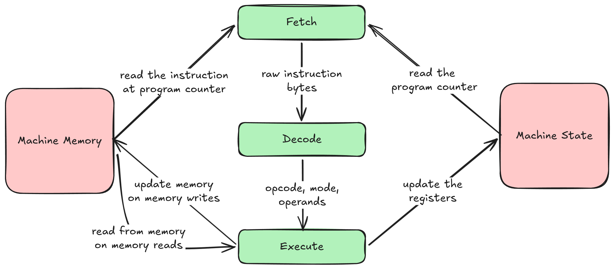

### Problem Context
A binary compiled for one instruction set needs to be executed in a machine with a different instruction set.

### Minimal Solution
A process that maintains a state corresponding to the architecture of the machine for which the binary was compiled for,
and handlers for each opcode in the original instruction set. The instructions in the binary are fetched, decoded and executed.



### Implementation

For MOS 6502,
```c
void cpu_step_interpreter(chip_t* chip) {
    TRACE_CPU_STATE(chip);

    const uint16_t pc_before = chip->program_counter;
    const uint8_t opcode = chip->memory[chip->program_counter++];

    if (opcode == 0x4C) {
        const uint8_t lo = chip->memory[chip->program_counter];
        const uint8_t hi = chip->memory[chip->program_counter + 1];

        const uint16_t target = (hi << 8) | lo;

        if (target == pc_before) {
            exit(0);
        }
    }

    execute_opcode(opcode, chip);
}
```
This follows the pattern of,
- fetching the instruction opcode from memory using the program counter
- decoding is not necessary here as MOS 6502 has granular opcode pattern where the opcodes for each combination of [operation, mode] is different
- executing the instruction 

The execution is done by maintaining a table of opcode handlers, with the handler mapped to an opcode occupying the corresponding index in the table.
```c
void execute_opcode(const uint8_t opcode, chip_t *chip) {
    opcode_table[opcode](chip);
}
```